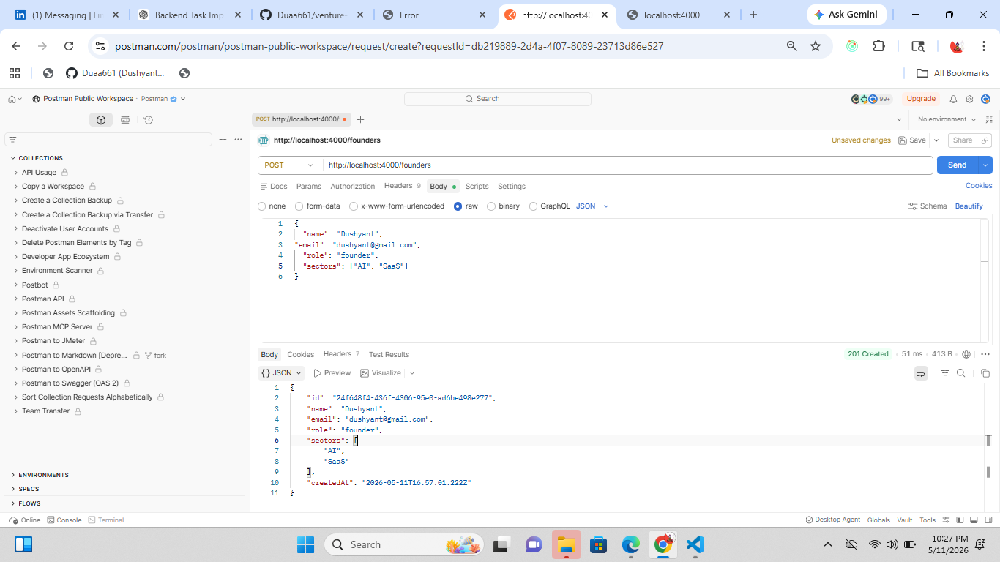
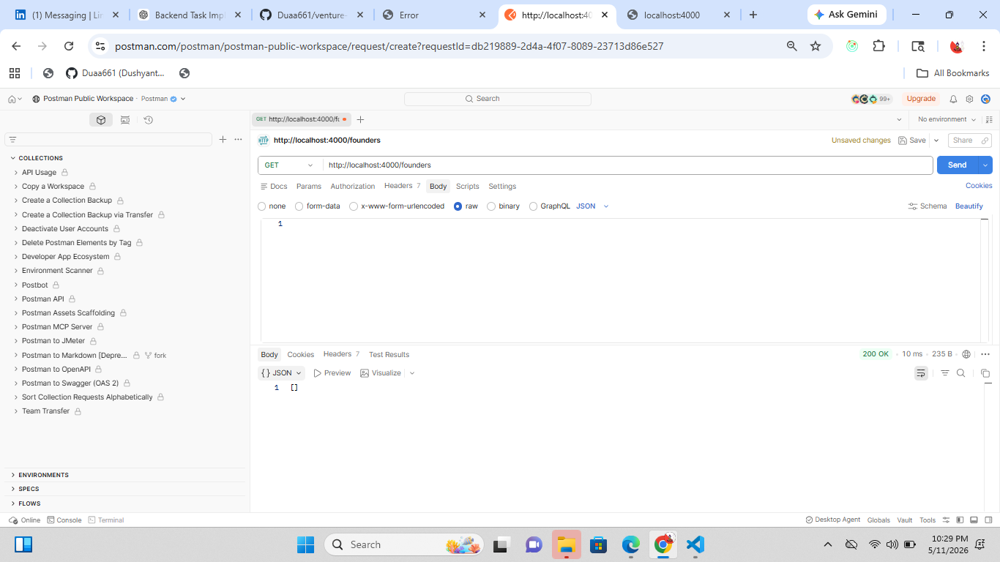
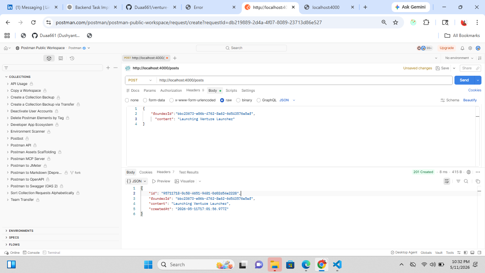
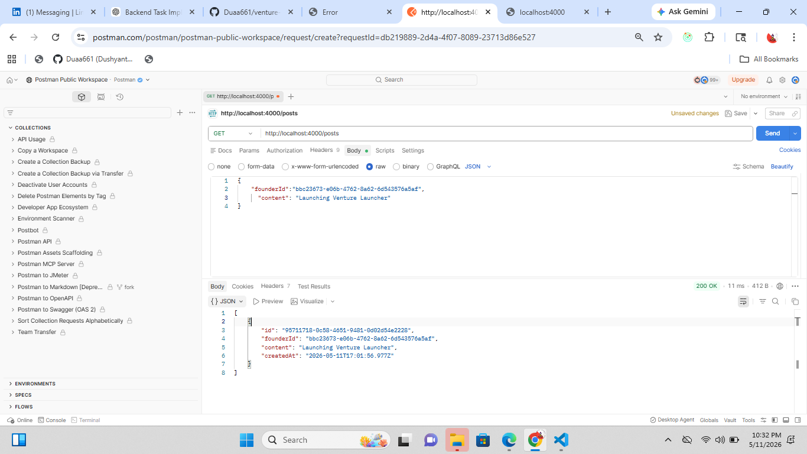

# Venture Launcher Backend Task Submission

Hi,

I’ve completed the Venture Launcher backend task and tested all endpoints successfully.

## GitHub Repository
https://github.com/Duaa661/venture-launcher-backend-test.git

## Implementation Includes

- Founder + Post APIs
- Input validation
- Proper HTTP status codes
- In-memory data storage
- Optional founder-based post filtering
- README with setup and endpoint documentation

# Postman Screenshots

## Create Founder

## Get Founders

## Create Post

## Get Posts

## Next Step

Looking forward to the next step.

Thanks,  
**Dushyant Rajput**